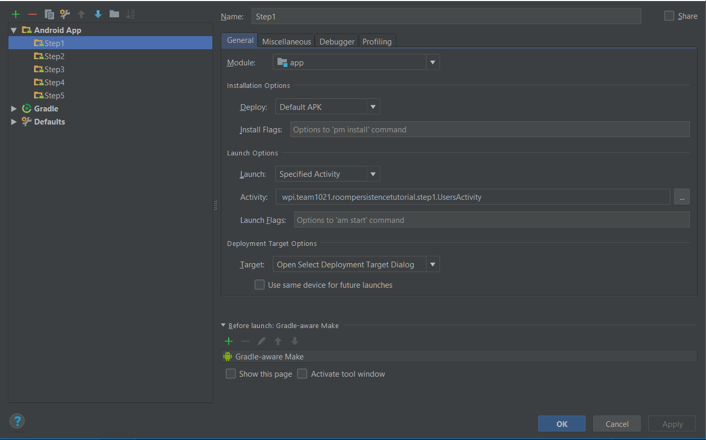
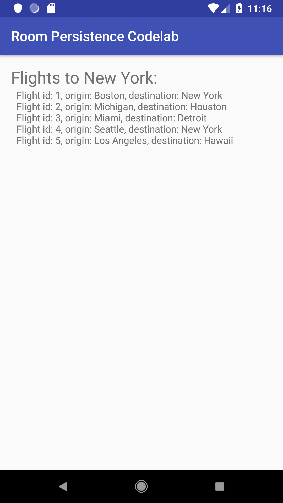
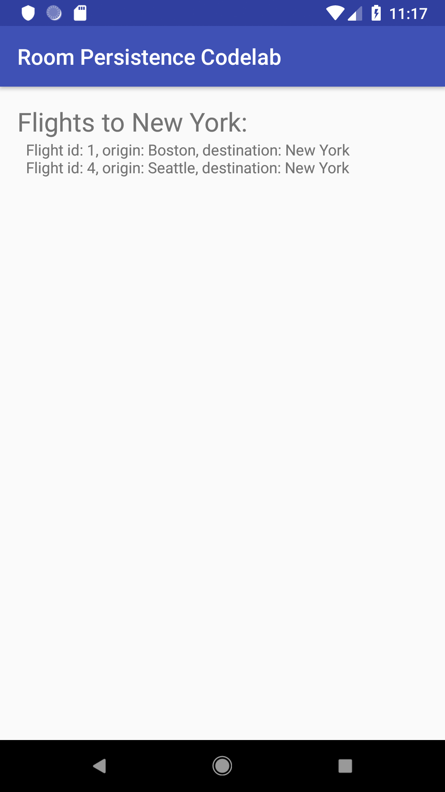
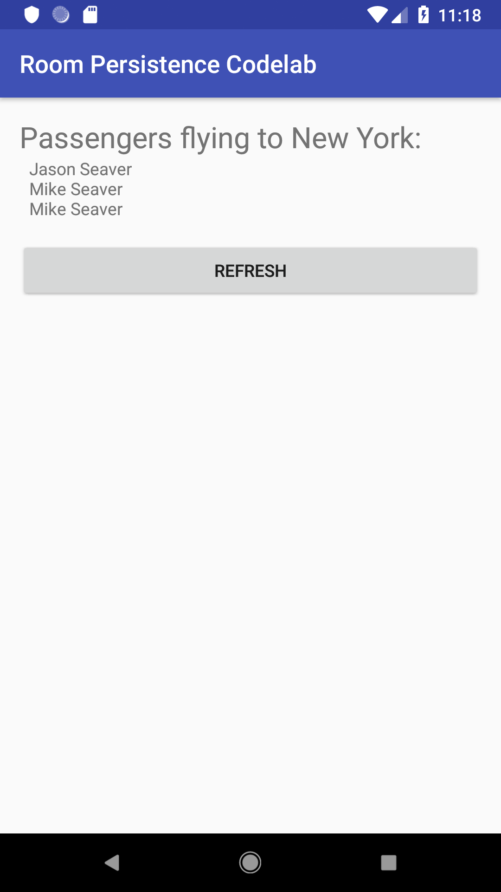
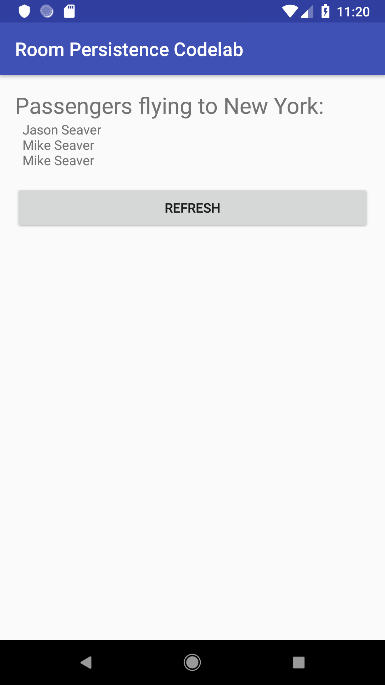
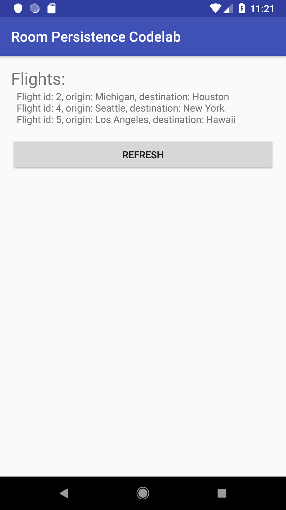
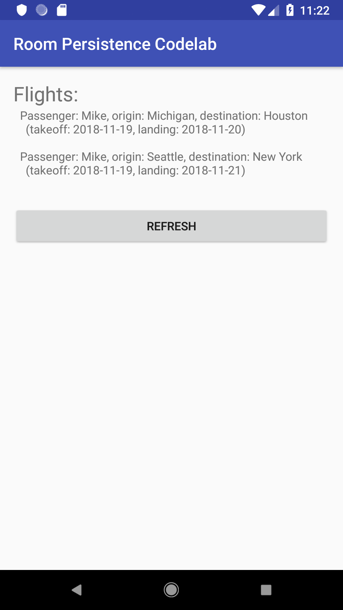

# CS4518 Topic Sruvey: Room Persistence
Author: Frank Campanelli, Zhung Keung Moo Feng (Erick)

## Overview of Tutorial
This tutorial will show you how to

- Fetch data with DAOs
- Define entity relationships
- Observe LiveData frmo a ViewModel
- Use custom Type Converters
- Add custom query result objects


Prerequisites:

- Android Studio installed
- AVD with API 23 or higher
- Starter code downloaded

## Set up environment
In this step, you download the code for the entire codelab.

[source code](https://github.com/frcampanelli/RoomPersistenceTutorial)

- Unzip the code, and then open the project using Android Studio.  Then, build the app to make sure there are no errors or missing dependencies.  
- Build the app by creating the Step1 run configuration shown here:



## Intruducing Room

_Adapted from the [Room Persistence Library](https://developer.android.com/topic/libraries/architecture/room) page:_  

If your app handles non-trivial amounts of data, you can gain a number of benefits by storing at least some of that data locally using Room. The most common benefit is to optimize network connectivity, by caching relevant data to ensure users can still browse that content while they are offline. Any changes the user makes to content can later be synced to the server, once the device is back online.

The core Android framework provides built-in support for working with raw SQL data. While the built-in APIs are very powerful, they also present a number of development challenges:

- They are relatively low-level, and require a large amount of development time and effort.
- Raw SQL queries are not verified at compile-time.
- You must manually update SQL queries to reflect changes in your data graph. This process is unnecessarily time consuming, and error-prone.
- You write and maintain a lot of boilerplate code to convert between SQL queries and data objects.

Room is designed to abstract away the underlying database tables and queries, and encourage best-practice development patterns on Android.

By default, Room doesn't allow you to issue database queries on the main thread to avoid poor UI performance. However querying on the main thread is enabled in this tutorial for simplicity.

Take some time to look over the `airportDB` package to learnabout the data entities, namely the

- `Flight` data class
- `Passenger` data class
- `Ticket` data class

Notice that the `@Entity` annotation to mark a data class as a persistable entity. At least one of the class fields must be annotated with the `@PrimaryKey` annotation.

The data classes hold information from the internal database for Java to use.  
In order to get Java objects with relevent data, we use DAO interfaces.  

- `FlightDao`
- `PassengerDao`
- `TicketDao`

The `@Dao` annotation is used to create data access objects, which define SQLite queries. You explore data access objects in more detail later in this tutorial.  
Finally, review the AppDatabase class, which is annotated using `@Database`.  
This pulls all the Dao interfaces together, and defines a version number for the database.

## Create Entities

Look at `Flight`. Notice its `@Entity` annotation is blank. This is becuase the `Flight` entity is just a simple data object to store data.  
Also notice how the `id` field is annotated with `@PrimaryKey` and `@NonNull`. These are the same as the `PRIMARY KEY` and `NON NULL` constraints in SQLite.  
Now look at `Ticket`. Its `@Entity` annotation is a little different:  
```
@Entity(foreignKeys = {
        @ForeignKey(entity = Flight.class,
                parentColumns = "id",
                childColumns = "flight_id"),

        @ForeignKey(entity = Passenger.class,
                parentColumns = "id",
                childColumns = "passenger_id")})
```
This entity has `@ForgienKey` annotations, to link the `FORGIEN KEY` constraints that should exist in the SQL.  
Notice how these forgien keys are reflected in the variables:  
```
@ColumnInfo(name="flight_id")
public String flightId;

@ColumnInfo(name="passenger_id")
public String passengerId;
```
The `@ColumnInfo` annotation tells Room exactly how the columns should be named in the internal database, so it matches the forgien key declarations.  

## Step 1 - Create DAOs

A Data Access Object (DAO) is an abstract class or interface that includes methods to define database queries. The annotated methods in this class are used to generate the corresponding SQL at compile time.  
These queries are annoted with `@Query` and contain the actual SQL queries that run when the method is called.  
```
@Query("SELECT * FROM Flight WHERE destination = :destination")
List<Flight> findAllFlightsByDestinationSolution(String destination);
```

There are also abstracted `@Insert` and `@Update` queries, which will ignore and replaceexisting records as indicated:  
```
@Insert(onConflict = IGNORE)
void insertFlight(Flight Flight);

@Update(onConflict = REPLACE)
void updateFlight(Flight Flight);
```

Next, open the step1 package and review the UsersActivity class, which fetches data from the database using the following code:  
```
private void fetchData() {
    // Note: this kind of logic should not be in an activity.
    StringBuilder sb = new StringBuilder();
    List<Flight> flights = mDb.flightModel().findAllFlightsByDestination("New York");
    for (Flight flight : flights) {
        sb.append(String.format(Locale.US,
                "Flight id: %s, origin: %s, destination: %s\n", flight.id, flight.origin, flight.destination));
    }
    mFlightsTextView.setText(sb);
}
```

>Caution: For simplicity, this activity has a reference to the database but in a real app the database would belong in a different component. We fix this later in the tutorial.

Create a run configuration for `UserActivity` in the `step1` package and run it. Notice how all flights are listed.  


We want to create a query to only shot flights to New York.  
Open `FlightDao` and create a new `@Query` to only select flights that have a destination of "New York"  
```
@Query("SELECT * FROM Flight WHERE destination = :destination")
List<Flight> findAllFlightsByDestination(String destination);
```
Next, call the new method from the activity, to only get flights that are going to New York:  
```
List<Flight> flights = mDb.flightModel().findAllFlightsByDestination("New York");
```
Run the app again and you should see that only flights from New York are listed:  


>Caution: The operation added in this step runs on the main thread. However input and output operations must be executed in the background. At this stage, you are probably not noticing any performance problems because the queries are simple and the database is stored in memory, rather than on disk. Also, placing all this logic in the activity is not considered best practice. We fix these problems in future steps.  

## Step 2 - Entity Relationships

Recall the `Ticket` class and how it had `@ForgienKey` relations set up.  
In this step we will show how these can be used with queries to get data across entities.  
Review the following annotated query from `PassengerDao`:  
```
@Query("SELECT Passenger.id, Passenger.name, Passenger.lastName, Passenger.age FROM Passenger " +
    "JOIN Ticket ON Ticket.passenger_id = Passenger.id " +
    "JOIN Flight ON Ticket.flight_id = Flight.id " +
    "WHERE Flight.destination LIKE :destination"
)
List<Passenger> findPassengersFlyingToDestSync(String destination);
```
Create a run configuration for `step2` and run the app to see passengers that are flying to New York:


You may notice a small performance problem when opening the app; the UI is blocked while the database is being populated.  
This operation is purposely slow, to simulate a worst-case scenario.

The database is popualting on the main UI thread. To change this remove the following code in `BadShowUserActivity`:
```
DatabaseInitializer.populateSync(mDb);
```
Replace the code you removed with the following statement, to switch to using an asynchronous task to populate the data:
```
DatabaseInitializer.populateAsync(mDb);
```

Run the app again, and notice that the list has no entries until you click the refresh button. This is becuase of a race condition. The databse is being populated in the background while the UI is being drawn.  
The query results arrive before `Ticket` is populated. Waiting a few seconds and then pressing **Refresh** will update the list to show the proper information.

## Step 3 - Create ViewModel and LiveData

In this step, you add LiveData, a lifecycle-aware component which can be observed, typically described as an observable.  
Simply wrapping your @Query return type with LiveData provides you with database observers for minimal extra effort.  
You also move the reference to the database, from the activity, to a ViewModel.

Explore the `step3` package. `PassengersFlyingToDestActivity` implements a `PassengersFlyingToDestViewModel`. This allows the app to automatically update the list of passengers as the database populates.  
Complete the `subscribeUiPassengers` method as follows to attach to the ViewModel:
```
private void subscribeUiPassengers() {
    mViewModel.passengers.observe(this, new Observer<List<Passenger>>() {
        @Override
        public void onChanged(@NonNull final List<Passenger> passengers) {
            showPassengersInUi(passengers);
        }
    });
}
```
Create and run the `step3` run configuration and notice how the list smoothly updates without needing to **Refresh**


## Step 4 - Create Custom Type Converters

Since SQLite only supports a few datatypes, sometimes certian Java objects will need to be represented differently in the database.  
This is solved with `@TypeConverters`.  
Open up `DateConverter` in the `airportDB` package and see how each method is annotated with `@TypeConverter`:
```
public class DateConverter {
    @TypeConverter
    public static Date toDate(Long timestamp) {
        return timestamp == null ? null : new Date(timestamp);
    }

    @TypeConverter
    public static Long toTimestamp(Date date) {
        return date == null ? null : date.getTime();
    }
}
```

The `java.util.Date` object will automatically be converted to a `Long`. This is useful when creating a query that accepts a Date:
```
@Query("SELECT * FROM Flight WHERE landingTime > :landingTime")
LiveData<List<Flight>> findAllFlightsByLandingTime(Date landingTime);
```
This query is called in the ViewModel:
```
mFlights = mDb.flightModel().findAllFlightsByLandingTime(tomorrow);
```
Create and run the `step4` configuration and see that only flights that land tomorrow are shown:


You can view the source code for the `DatabaseInitializer` class for additional details on what initial data is being inserted and how initialization is implemented.

## Step 5 - Custom Query Result Objects

Custom query result objects let us hold and possibly display more information than what regular query result objects can. For example, we want to show the flights of a specific passenger, in this case Mike, that land anytime tomorrow and beyond.



To do this we use a query that gets data from both Flights and Passenger.

```
@Query("SELECT * " +
        "FROM Flight " +
        "INNER JOIN Ticket ON Ticket.flight_id = Flight.id " +
        "INNER JOIN Passenger on Passenger.id = Ticket.passenger_id " +
        "WHERE Passenger.name LIKE :firstName " +
        "AND Flight.landingTime > :landingTime ")
LiveData<List<TicketWithPassengerAndFlight>> findTicketsByPassengerAndLandingTime(String firstName, Date landingTime);
```

This returns a query result object that we define in the `TicketWithPassengerAndFlight` class. The fields returned from the query must match the fields in the class. This is verified at compile time, and raises a warning if there is a mismatch.
